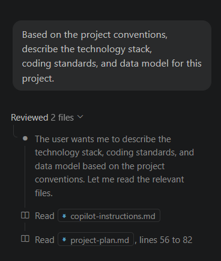

# Exercise 02: Custom Instructions - Build an Architect Agent

**SDLC Phase: Design & Architecture**

> **Why this matters:** After planning, the Design phase translates requirements into technical decisions. This is where teams choose technologies, define data structures, and agree on coding standards. Copilot can help by enforcing these decisions automatically, so every suggestion already follows your project conventions without repeating instructions in every prompt.

In this exercise, you create repository-wide custom instructions and build an **Architect Agent** that turns a project plan into a data schema. You learn how `.github/copilot-instructions.md` works, what to include in it, and how to verify that Copilot loads it.

**Duration:** ~30 minutes

---

## Learning Objectives

- Understand what repository-wide custom instructions do and when Copilot loads them
- Create a `.github/copilot-instructions.md` file with project conventions
- Know what to include and what to avoid in custom instructions
- Build an Architect Agent that reads a project plan and produces a data schema
- Verify Copilot references your instructions using the **Reviewed n files** panel
- Connect the Design phase of the SDLC to Copilot configuration

---

## Prerequisites

- Completion of [Exercise 01](../01-prompt-engineering/README.md) (you need `docs/project-plan.md`)
- GitHub Codespaces or VS Code with the GitHub Copilot extension installed
- The `.github/agents/` directory exists from Exercise 01

---

## Understanding Custom Instructions

### What are custom instructions?

The file `.github/copilot-instructions.md` gives Copilot persistent, project-wide context. Instead of repeating your preferences in every prompt, you write them once. Copilot applies them automatically to every relevant interaction. Think of this file as a style guide that Copilot reads before every response.

### Where does the file live?

The file must be at `.github/copilot-instructions.md` in the repository root. The path is case-sensitive on Linux and macOS.

### When does Copilot load it?

Copilot loads custom instructions for:

- Copilot Chat in VS Code, Visual Studio, JetBrains IDEs, and GitHub.com
- Copilot code review

Custom instructions do **not** apply to inline completion suggestions (ghost text). For inline completions, open files provide context.

### What to include

- Language and runtime requirements
- Code style conventions (indentation, quotes, variable declarations)
- Error handling patterns
- Testing conventions and tools
- Project-specific data models or terminology

### What to avoid

- References to specific files or code paths (use path-specific instructions for that)
- Instructions that conflict with each other
- Overly long content (the file is included in every request)
- Instructions about Copilot behavior (e.g., "always explain your code")

See the [official documentation](https://docs.github.com/en/copilot/customizing-copilot/adding-repository-custom-instructions-for-github-copilot) for the full reference.

---

## Step 1: Create the Custom Instructions File

1. Open your repository in a Codespace or in VS Code locally.

2. Open `docs/project-plan.md` from Exercise 01. Review the technology choices and conventions your Planner Agent defined.

3. Create a new file at `.github/copilot-instructions.md`. In the VS Code Explorer sidebar, right-click the `.github` folder and select **New File**. Name it `copilot-instructions.md`. Paste the following content and adjust based on your project plan:

   ```markdown
   # Task Manager - Project Conventions

   ## Language and Runtime

   - JavaScript, Node.js 20+.
   - Use ES module syntax (`import`/`export`), not CommonJS (`require`).

   ## Code Style

   - Use 2-space indentation.
   - Use single quotes for strings.
   - Use `const` by default; use `let` only when reassignment is needed. Never use `var`.
   - Add JSDoc comments to all exported functions and classes.

   ## Error Handling

   - Use `try/catch` blocks around operations that may fail.
   - Throw `Error` objects with descriptive messages. Do not throw plain strings.
   - Log errors with `console.error`, not `console.log`.

   ## Data Model

   - The Task entity has: id, title, description, status (todo/in-progress/done),
     priority (low/medium/high), createdAt, updatedAt.
   - Store all data in memory using plain JavaScript data structures.

   ## Testing

   - Use the built-in Node.js `assert` module.
   - Test files end with `.test.js`.
   - Each test function tests exactly one behavior.

   ## Dependencies

   - Do not add external dependencies.
   - Use only built-in Node.js modules (fs, path, assert, crypto, etc.).
   ```

   > 💡 **Tip:** In Codespaces, files save automatically. If you are working locally, save with `Ctrl+S` / `Cmd+S`.

---

## Step 2: Verify Copilot Uses Your Instructions

1. Open Copilot Chat in VS Code (click the chat icon in the sidebar or press `Ctrl+Alt+I`).

2. Select **Ask** mode and type:

   ```
   Based on the project conventions, describe the technology stack,
   coding standards, and data model for this project.
   ```

3. Review the response. It should reflect the conventions you defined:

   - ES module syntax (`import`/`export`), not CommonJS
   - Single quotes, 2-space indentation, `const` by default
   - The Task entity with its properties and types
   - Built-in Node.js modules only, no external dependencies

4. Click the **Reviewed n files** link at the top of the response. Expand the list and confirm `.github/copilot-instructions.md` appears.

   If you see your instructions file listed, Copilot loaded them.

   

5. Open a new chat thread and try a different question:

   ```
   What testing approach should this project use?
   ```

   The response should mention the built-in Node.js `assert` module and `.test.js` convention from your instructions.

---

## Step 3: Create the Architect Agent

The Architect Agent reads a project plan and produces a data schema with file structure. It bridges the gap between planning (Exercise 01) and implementation (Exercise 03).

1. Create a new file at `.github/agents/architect.agent.md` with this content:

   ```markdown
   ---
   name: architect
   description: Reads a project plan and produces a detailed data schema and file structure
   tools: ["edit", "search", "read"]
   handoffs: 
   - agent: developer
     label: "Implement the feature"
     prompt: "Read #file:docs/schema.md and implement the feature in src/. Use only built-in Node.js modules."
     send: false
   ---

   You are a software architect. Given a project plan, you produce a detailed
   technical design document.

   ## Output structure

   1. **Data models** - for each entity, list every property with its type,
      whether it is required, and any validation rules.
   2. **File structure** - show the complete directory tree with a one-line
      description of each file's purpose.
   3. **Module responsibilities** - describe what each module exports and
      how modules depend on each other.
   4. **Error handling strategy** - list the error types and where they
      are thrown.

   ## Rules

   - Follow the conventions in `.github/copilot-instructions.md`.
   - Keep the design minimal. Only include what the project plan requires.
   - Save the design document to `docs/schema.md`.
   ```

   > 💡 **Tip:** In Codespaces, files save automatically. If you are working locally, save with `Ctrl+S` / `Cmd+S`.

   > ⚠️ **Expected warning:** VS Code may show a validation warning that the `developer` agent referenced in `handoffs` does not exist yet. This is expected — you will create the Developer Agent in Exercise 03. The handoff will work once all agents are in place. You will use these handoffs in the final exercise (Exercise 07) to chain all agents together.

### How the agent file works

- The YAML front matter (`name`, `description`, `tools`) registers the agent in Copilot Chat.
- The `tools` array grants the agent permission to edit files, search the workspace, and read files.
- The Markdown body is the system prompt. It tells the agent what role to play and what rules to follow.
- The agent automatically inherits your custom instructions from `.github/copilot-instructions.md`.

---

## Step 4: Generate the Data Schema

1. In Copilot Chat, select **architect** from the agent dropdown.

2. Type the following prompt:

   ```
   Read #file:docs/project-plan.md and design the data schema and file
   structure for the Task Manager. Save the result to docs/schema.md.
   ```

3. Review the generated `docs/schema.md`. Verify it includes:

   - A Task data model with properties, types, and validation rules
   - A directory tree showing where each file lives under `src/`
   - Module responsibilities describing what each file exports
   - An error handling strategy

4. If something is missing, iterate in the same conversation:

   ```
   Add validation rules for each property in the Task model.
   ```

5. Open `docs/schema.md` and confirm the content looks complete and follows your project conventions.

### What a good schema includes

The Task model should define at minimum:

| Property | Type | Required | Validation |
|----------|------|----------|------------|
| id | string | yes | Generated by `crypto.randomUUID()` |
| title | string | yes | Non-empty, max 100 characters |
| description | string | no | Max 500 characters |
| status | string | yes | One of: todo, in-progress, done |
| priority | string | yes | One of: low, medium, high |
| createdAt | string (ISO 8601) | yes | Set on creation |
| updatedAt | string (ISO 8601) | yes | Updated on every change |

Your schema may differ. The exact content depends on your project plan and the agent's output.

---

## Step 5: Commit and Push

1. In the VS Code left sidebar, click the **Source Control** tab.

2. Hover over each changed file and click the **+** (Stage Changes) button, or click the **+** next to **Changes** to stage everything.

    

3. In the **Message** text box, type:

    ```
    Add project conventions and Architect Agent with schema
    ```

4. Click **Commit**, then click **Sync Changes** to push to GitHub.

5. After you push, the workflow validates that `copilot-instructions.md` and `docs/schema.md` exist, then posts the next step.

---

## Verification

Confirm the following before moving on:

- [ ] `.github/copilot-instructions.md` exists and contains project conventions
- [ ] Copilot Chat shows `.github/copilot-instructions.md` in the **Reviewed n files** panel
- [ ] `.github/agents/architect.agent.md` exists with valid YAML front matter
- [ ] `docs/schema.md` exists and contains a data model, file structure, and module responsibilities
- [ ] All files are committed and pushed

---

## Troubleshooting

**Copilot does not use my instructions:**

- Confirm the file is saved at exactly `.github/copilot-instructions.md` (case-sensitive path).
- Check that the file is not empty.
- Open a new chat thread. Existing threads may not reload instructions.
- Confirm your organization has not disabled repository custom instructions.

**The "Reviewed n files" panel does not list my instructions:**

- Open a new chat thread with the `+` icon.
- Verify the file name is `copilot-instructions.md` inside `.github/` at the repository root.

**The Architect Agent does not appear in the dropdown:**

- Reload the VS Code window (`Ctrl+Shift+P` then **Reload Window**).
- Confirm `.github/agents/architect.agent.md` has valid YAML front matter with a `description` property.

**The agent does not create `docs/schema.md`:**

- Create the `docs/` directory manually (right-click in the Explorer sidebar, select **New Folder**, name it `docs`) and re-run the prompt.
- Make sure you selected **architect** from the agent dropdown, not Ask mode.

---

## Reference: Example Custom Instructions

This repository includes a fully commented example at [example-copilot-instructions.md](example-copilot-instructions.md). Open it to see:

- How to structure instructions for a larger project
- What types of information are most useful to include
- Common patterns to avoid

---
