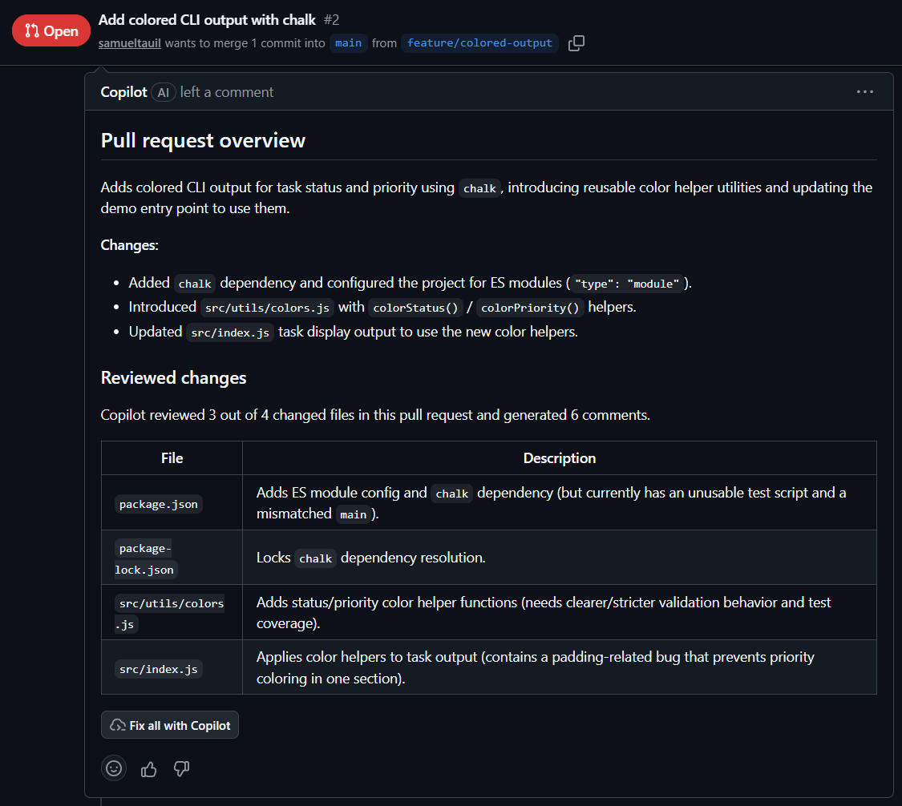
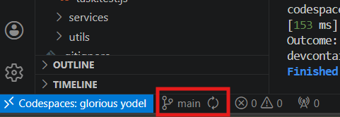
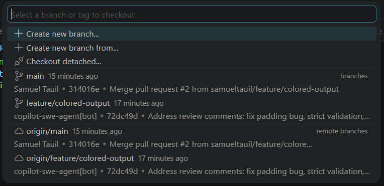

# Exercise 05: Code Review - Review a Pull Request with Copilot

**SDLC Phase: Code Review**

> **Why this matters:** Code review catches issues that testing alone cannot find: naming inconsistencies, missing documentation, design concerns, and potential security problems. Copilot can automate parts of this process by reviewing pull requests and leaving structured feedback, so reviewers can focus on the high-value decisions.

In this exercise, you add a new feature to the Task Manager, ask Copilot to create a pull request, and then use Copilot code review to review the changes. You also update your project conventions to reflect the new dependency.

**Duration:** ~30 minutes

---

## Workshop Roadmap

| Exercise | Copilot Concept | Agent | SDLC Phase |
|----------|----------------|-------|------------|
| 01 | Prompt engineering and interaction modes | Planner | Planning |
| 02 | Repository-wide custom instructions | Architect | Design |
| 03 | Path-specific instructions | Developer | Implementation |
| 04 | Prompt files | Tester | Testing |
| **05 (this one)** | **Copilot code review** | **—** | **Code Review** |
| 06 | Dependency security | — | Security |
| 07 | Agent files and orchestration | Orchestrator | Full lifecycle |

---

## Learning Objectives

- Understand how Copilot code review works on pull requests
- Use Copilot in Agent mode to implement a feature and create a PR end-to-end
- Request and respond to Copilot code review feedback on GitHub.com
- Update project conventions when requirements change
- Connect the Code Review phase of the SDLC to Copilot features

---

## Prerequisites

- Completion of [Exercise 01](../01-prompt-engineering/README.md) through [Exercise 04](../04-copilot-chat-skills/README.md)
- A working Task Manager application with tests passing (`node --test tests/`)
- GitHub Codespaces or VS Code with the GitHub Copilot extension installed

---

## Understanding Copilot Code Review

### What is Copilot code review?

GitHub Copilot can review pull requests on GitHub.com. When you request a review from Copilot, it analyzes the diff — the changes between your branch and the base branch — and leaves inline comments with suggestions, potential issues, and improvements.

### How does it work?

1. You open a pull request on GitHub.
2. You request a review from **Copilot** (just like requesting from a teammate).
3. Copilot reads the diff, your custom instructions, and the surrounding code.
4. It leaves review comments with explanations and code suggestions.
5. You address the feedback and merge the PR.

### What does Copilot review for?

- Code quality issues (unused variables, redundant code, complexity)
- Style violations (based on your custom instructions)
- Potential bugs and edge cases
- Missing error handling
- Documentation gaps

Copilot code review respects your `.github/copilot-instructions.md` file, so its feedback aligns with your project conventions.

### Why add a dependency now?

Until this point, the Task Manager used only built-in Node.js modules. Real-world projects eventually need external dependencies. Adding one now lets you practice the review workflow and sets up Exercise 06, where you configure Dependabot to monitor your dependencies for security vulnerabilities.

---

## Step 1: Add Colored Output with Chalk

The Task Manager CLI prints plain text. Adding colored status labels makes the output more readable. This feature uses the [chalk](https://www.npmjs.com/package/chalk) npm package.

1. Open Copilot Chat in VS Code and select **Agent** mode.

2. Enter the following prompt:

   ```
   Add colored terminal output to the Task Manager using the chalk
   npm package. Follow these requirements:

   - Status "done" should display in green
   - Status "in-progress" should display in yellow
   - Status "todo" should display in red
   - Priority "high" should display in bold red
   - Priority "medium" should display in bold yellow
   - Priority "low" should display in dim text

   Steps:
   1. Initialize the project with npm init if package.json does not
      exist. Set "type": "module" in package.json for ES module support.
   2. Install chalk as a dependency.
   3. Create src/utils/colors.js with helper functions that wrap
      status and priority values in chalk colors.
   4. Update src/index.js to use the color helpers when displaying tasks.
   5. Run src/index.js to verify the colored output works.

   After everything works:
   6. Create a new branch called feature/colored-output.
   7. Commit all changes to that branch.
   8. Push the branch and create a pull request to main with the title
      "Add colored CLI output with chalk" and a description of changes.
   ```

3. Review the changes Copilot makes. Approve file creations and edits as prompted.

4. When Copilot finishes, verify the PR was created. You should see a link in the chat output, or you can check the repository on GitHub.

   > 🪧 **Note:** If Copilot cannot create the PR directly, you can create it manually: open the VS Code Source Control sidebar, click the **...** menu, and select **Create Pull Request**. Or navigate to the repository on GitHub and create the PR from the `feature/colored-output` branch.

### What Copilot does behind the scenes

When you give Copilot an end-to-end prompt like this in Agent mode, it:

1. Reads your custom instructions to understand project conventions
2. Runs terminal commands to initialize npm and install chalk
3. Creates and edits files in the workspace
4. Runs the code to verify it works
5. Uses git to create a branch, commit, push, and open a PR

This is the agent in action — it plans, executes, verifies, and iterates autonomously.

---

## Step 2: Review the PR with Copilot

1. Open the pull request on GitHub.com.

2. In the **Reviewers** section on the right sidebar, click the gear icon and select **Copilot** to request a code review.

   > 🪧 **Note:** If Copilot code review is not available on your repository (it requires GitHub Copilot Enterprise or organization settings), you can review the PR manually. Read through the diff and check that the implementation follows your project conventions.

3. Wait for Copilot to complete the review. It will leave a summary comment with a table of reviewed files and inline comments on the PR diff.

4. Read the review summary. Copilot may:

   - Suggest improvements to code quality
   - Point out missing error handling
   - Recommend better variable names or documentation
   - Flag potential issues with the chalk integration

5. At the bottom of the review summary, click **Fix all with Copilot** to let Copilot automatically address every comment it raised. Copilot will push fix commits directly to the PR branch.

    

   > 🪧 **Note:** You can also address comments individually — click **Commit suggestion** on a single inline comment to apply that fix, or make the change manually and push.

6. Once all review feedback is addressed, **merge the pull request** on GitHub.

---

## Step 3: Pull the Merged Changes

After merging the PR, bring the changes back to your local environment.

1. Click the **branch name** in the bottom-left corner of the VS Code status bar.

    

2. In the branch picker that appears, select **main** to switch branches.

    

3. Open the VS Code Source Control sidebar and click **Sync Changes** to pull the merged PR changes.

4. Verify the colored output works:

   ```bash
   node src/index.js
   ```

   You should see task statuses and priorities displayed in color.

---

## Step 4: Update Project Conventions

The project now has an external dependency. Your custom instructions said "no external dependencies," which is no longer accurate. Keeping conventions current is part of maintaining a healthy project.

1. Open `.github/copilot-instructions.md`.

2. Find the **Dependencies** section and update it:

   ```markdown
   ## Dependencies

   - Use only built-in Node.js modules for core functionality.
   - The `chalk` package is approved for terminal output formatting.
   - Do not add other external dependencies without approval.
   ```

3. Save the file.

---

## Step 5: Commit and Push

1. In the VS Code left sidebar, click the **Source Control** tab.

2. Hover over each changed file and click the **+** (Stage Changes) button, or click the **+** next to **Changes** to stage everything.

    

3. In the **Message** text box, type:

    ```
    Add colored output feature and update project conventions
    ```

4. Click **Commit**, then click **Sync Changes** to push to GitHub.

5. After you push, the workflow validates that `package.json` exists with chalk, then posts the next step.

---

## Verification Checklist

Before moving on, confirm each item:

- [ ] `package.json` exists with `"type": "module"` and `chalk` as a dependency
- [ ] `src/utils/colors.js` exists with color helper functions
- [ ] `src/index.js` uses the color helpers for task display
- [ ] A pull request was created, reviewed, and merged
- [ ] `.github/copilot-instructions.md` is updated to reflect the chalk dependency
- [ ] `node src/index.js` runs and shows colored output
- [ ] All files are committed and pushed

---

## Troubleshooting

**Copilot cannot run npm commands:**

- Run them manually in the terminal: `npm init -y && npm pkg set type=module && npm install chalk`.
- Then ask Copilot to create the color helper file and update index.js.

**The PR was not created automatically:**

- Create a branch manually: `git checkout -b feature/colored-output`
- Stage and commit: `git add -A && git commit -m "Add colored output with chalk"`
- Push: `git push -u origin feature/colored-output`
- Open the PR on GitHub.com from the `feature/colored-output` branch.

**Copilot code review is not available:**

- This feature requires GitHub Copilot Enterprise or specific organization settings.
- Review the PR manually as a fallback. The learning goal is the review workflow, not the automation.

**Chalk colors do not display:**

- Ensure you are running in a terminal that supports ANSI colors (the Codespace terminal does).
- Verify `chalk` is installed: check that `node_modules/chalk` exists.
- Verify `package.json` has `"type": "module"` for ES module support.

**Import errors after adding chalk:**

- Confirm `package.json` contains `"type": "module"`.
- Confirm all import statements use the correct syntax: `import chalk from 'chalk';`

---
